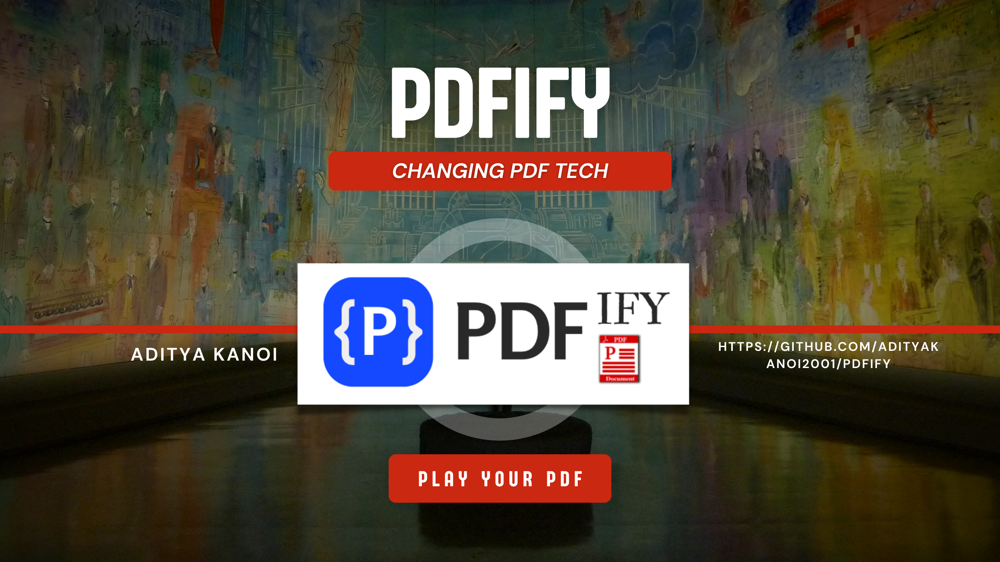

# PDFify Version Taxiway : 1.0.2
Project To Do PDF Operations Using JAVA SpringBoot API's
Developed By Aditya Sunit Kanoi 👨‍💻
----------------------------------------------------------------

PDFify is a Spring Boot Java-based project that allows you to perform various PDF operations, including upload, download, upload multiple files, search text in files, and get results. 

## Features

📂 Upload: Easily upload PDF files to the application.

📥 Download: Download PDF files from the application.

📋 Upload Multiple Files: Simultaneously upload multiple PDF files.

🔍 Search Text: Search for specific text within PDF files.

📑 Get Results: Retrieve search results from by Searching around All PDF Files.

📜 Summarize the PDF Using Strong AI model and Get a Small-Summarized Version of the PDF 

## Technologies Used

- Spring Boot: For building the backend application.
- Java: The programming language used for implementation.
- MongoDB: To store and manage PDF files and data.
- PDFBox Library for Playing Around With PDF
- ChatGPT-4 Model for Summarization of PDF

## How to Use

1. Clone the repository to your local machine.
2. Run the application using your preferred IDE or by using the command `mvn spring-boot:run`.
3. Access the application at `http://localhost:8500`.

## Endpoints

1. **POST /api/v1/pdfify/storeSingleFile**:
   - Description: Upload a single PDF file to the application.
   - Request Method: POST
   - Request Parameters:
     - `file`: The PDF file to be uploaded.
   - Response: Returns a `FileUploadResponse` object containing details about the uploaded file, including the file name, download URI, content type, and size.

2. **GET /api/v1/pdfify/downloadFile/{fileName:.+}**:
   - Description: Download a specific PDF file by providing its file name.
   - Request Method: GET
   - Path Variable:
     - `fileName`: The name of the PDF file to be downloaded.
   - Response: Returns the requested PDF file as a `Resource` in the response body. The content type and content disposition (attachment with filename) are also set in the response headers.

3. **POST /api/v1/pdfify/summarizeMyFile**:
   - Description: Summarize a PDF file uploaded to the application.
   - Request Method: POST
   - Request Parameters:
     - `file`: The PDF file to be summarized.
   - Response: Returns the summarized text of the provided PDF file as a string.

4. **GET /api/v1/pdfify/searchTextInFile**:
   - Description: Search for a text in all the PDF files stored in the application and get a list of matching file names.
   - Request Method: GET
   - Request Parameters:
     - `searchText`: The text to search for in the PDF files.
   - Response: Returns a list of file names of PDF files that contain the searched text.

5. **GET /api/v1/pdfify/getFileWhichContainsSearchText**:
   - Description: Get the first PDF file where the searched text exists.
   - Request Method: GET
   - Request Parameters:
     - `searchText`: The text to search for in the PDF files.
   - Response: Returns the first PDF file that contains the searched text as a `Resource` in the response body. The content disposition (attachment with filename) is also set in the response headers.

## How to Contribute

Contributions are always welcome! If you have any ideas, improvements, or bug fixes, feel free to open an issue or submit a pull request.

🌟 Please star the repository if you find it helpful!

Thank you for using PDFify! 😊

----------------------------------------------------------------

# 💡 UPCOMING FEATURES!!

- [ ] 📑 **PDF Bills Summarization**
  Easily summarize your PDF-based bills with clear and concise tables. No more manual sorting through lengthy documents!

- [ ] 📸 **Mobile Image Bills Summary**
  Click a picture of your bills using your mobile and receive a neatly compiled summary report straight to your email.

- [ ] 📝 **AI-Generated Logo and Contact Info**
  Give your documents a professional touch! Automatically update your documents with a custom AI-generated logo and contact information.

- [ ] ⏬ **Bulk PDF Upload**
  Save time by uploading multiple PDFs at once! Our platform allows for quick and efficient bulk uploading.

Stay tuned for these exciting updates! 🔥💯🚀

Feel free to reach out if you have any suggestions or questions. We're continuously working to enhance your experience. Happy PDFifying! 😄🧾
